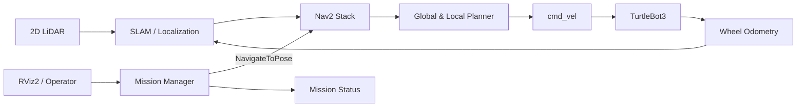

# TurtleBot Autonomous Mission

> **ROS 2와 TurtleBot3로 구현하는 실내 자율주행·순찰 로봇 프로젝트**

[](https://docs.ros.org/en/humble/)
[](https://emanual.robotis.com/docs/en/platform/turtlebot3/overview/)
[](https://gazebosim.org/)
[](https://www.python.org/)

**TurtleBot Autonomous Mission**은 TurtleBot3가 미지의 실내 공간을 탐색하고, 생성한 지도 위에서 지정된 경유지를 순찰하며, 장애물이나 비상 상황에 스스로 대응하도록 설계한 ROS 2 기반 프로젝트입니다.

Gazebo 시뮬레이션부터 실제 로봇 배포까지 동일한 인터페이스를 사용하며, SLAM·Navigation·Mission Control을 독립된 모듈로 구성해 기능을 쉽게 확장할 수 있습니다.

---

## Mission

로봇에게 순찰 지점을 전달하면 다음 임무를 자율적으로 수행합니다.

1. LiDAR와 Odometry를 이용해 현재 위치를 추정합니다.
2. Nav2가 충돌 없는 최적 경로를 생성합니다.
3. 지정된 경유지를 순서대로 방문합니다.
4. 동적 장애물을 감지하면 감속하거나 경로를 재탐색합니다.
5. 모든 지점의 순찰을 마친 뒤 충전 스테이션으로 복귀합니다.

```text
[READY] -> [NAVIGATING] -> [INSPECTING] -> [NEXT WAYPOINT]
   ^              |                                  |
   |              v                                  |
   +-------- [RECOVERY] <----------------------------+
   |
   +---------------------- [RETURN HOME] <- [COMPLETE]
```

## Key Features

| 기능 | 설명 |
| --- | --- |
| 실시간 지도 생성 | `slam_toolbox` 기반 2D SLAM 및 지도 저장 |
| 자율주행 | Nav2 기반 전역·지역 경로 계획과 장애물 회피 |
| 다중 경유지 순찰 | YAML로 정의한 순찰 지점을 순차적으로 수행 |
| 자동 복구 | 경로 이탈, 주행 정체, 목표 실패 시 행동 트리 기반 복구 |
| 상태 모니터링 | 배터리, 위치, 현재 임무, 성공률을 토픽으로 제공 |
| Simulation First | Gazebo에서 검증한 설정을 실제 TurtleBot3에 동일하게 적용 |
| 긴급 정지 | 장애물 근접 또는 사용자 명령에 즉시 주행 정지 |

## System Architecture



### Tech Stack

- **Platform:** TurtleBot3 Burger / Waffle Pi
- **Middleware:** ROS 2 Humble, DDS
- **Localization:** AMCL, Robot Localization
- **Mapping:** SLAM Toolbox
- **Navigation:** Nav2, Behavior Tree
- **Simulation:** Gazebo, RViz2
- **Language:** Python 3, C++17

## Package Structure

```text
mission_app/
├── mission_bringup/        # 전체 시스템 실행 및 파라미터
│   ├── launch/
│   └── config/
├── mission_control/        # 경유지 관리와 임무 상태 머신
├── mission_navigation/     # Nav2 설정 및 커스텀 Behavior Tree
├── mission_description/    # 로봇 모델과 Gazebo 월드
├── mission_interfaces/     # 커스텀 Message, Service, Action
├── maps/                   # 저장된 지도와 순찰 경로
└── README.md
```

> 위 구조는 프로젝트의 목표 아키텍처를 나타냅니다. 필요한 패키지를 순서대로 구현하며 확장할 수 있습니다.

## Quick Start

### 1. Requirements

- Ubuntu 22.04
- ROS 2 Humble Hawksbill
- Gazebo 11
- TurtleBot3 Packages
- Colcon

### 2. Workspace Setup

```bash
mkdir -p ~/turtlebot_ws/src
cd ~/turtlebot_ws/src
git clone https://github.com/Taegyu-Lee1117/mission_app.git

cd ~/turtlebot_ws
rosdep install --from-paths src --ignore-src -r -y
colcon build --symlink-install
source install/setup.bash
```

### 3. Run Simulation

```bash
export TURTLEBOT3_MODEL=burger
ros2 launch mission_bringup simulation.launch.py
```

RViz2에서 초기 위치를 지정한 후 샘플 순찰 임무를 시작합니다.

```bash
ros2 launch mission_control patrol.launch.py \
  route:=config/demo_route.yaml \
  loop:=false
```

### 4. Build a Map

```bash
ros2 launch mission_bringup mapping.launch.py
ros2 run nav2_map_server map_saver_cli -f maps/office
```

## Running on TurtleBot3

로봇과 Remote PC를 같은 네트워크에 연결하고 두 장치의 `ROS_DOMAIN_ID`를 동일하게 설정합니다.

```bash
export ROS_DOMAIN_ID=30
export TURTLEBOT3_MODEL=burger
```

TurtleBot3 SBC에서 로봇 드라이버를 실행합니다.

```bash
ros2 launch turtlebot3_bringup robot.launch.py
```

Remote PC에서 자율주행과 미션 노드를 실행합니다.

```bash
ros2 launch mission_bringup robot_navigation.launch.py \
  map:=maps/office.yaml
```

> 실제 주행 전에는 로봇 주변의 안전 공간을 확보하고 비상 정지 수단을 준비하세요.

## Mission Configuration

순찰 경로는 YAML 파일로 간단히 정의합니다.

```yaml
mission:
  name: office_night_patrol
  loop: false
  return_home: true

waypoints:
  - name: entrance
    pose: {x: 1.2, y: 0.4, yaw: 0.0}
    wait_sec: 3
  - name: meeting_room
    pose: {x: 4.8, y: -1.5, yaw: 1.57}
    wait_sec: 5
  - name: server_room
    pose: {x: 7.1, y: 2.3, yaw: 3.14}
    wait_sec: 10
```

## ROS Interfaces

| 이름 | 타입 | 용도 |
| --- | --- | --- |
| `/mission/start` | Service | 등록된 임무 시작 |
| `/mission/cancel` | Service | 현재 임무 취소 및 정지 |
| `/mission/status` | Topic | 진행 단계, 목표 지점, 성공률 제공 |
| `/navigate_to_pose` | Action | Nav2 목표 위치 전달 |
| `/cmd_vel` | Topic | 모바일 베이스 속도 명령 |
| `/scan` | Topic | 2D LiDAR 거리 데이터 |

## Demo Scenario

**Office Night Patrol**은 퇴근 후 사무실을 순찰하는 시나리오입니다.

- 출입구, 회의실, 서버실을 지정 순서로 방문
- 각 구역에서 일정 시간 정지 후 상태 확인
- 통로에 나타난 장애물을 감지하고 우회
- 목표 도달 실패 시 최대 3회 복구 시도
- 순찰 종료 후 시작 위치로 자동 복귀

### Performance Goals

| 항목 | 목표 |
| --- | ---: |
| 위치 추정 평균 오차 | 0.15 m 이하 |
| 정적 장애물 회피 성공률 | 95% 이상 |
| 경유지 도달 성공률 | 90% 이상 |
| 긴급 정지 응답 시간 | 200 ms 이하 |

## Roadmap

- [x] 시스템 아키텍처 및 인터페이스 설계
- [ ] Gazebo 사무실 월드 구축
- [ ] SLAM 및 Nav2 파라미터 튜닝
- [ ] 다중 경유지 Mission Manager 구현
- [ ] 장애 상황 자동 복구 로직 구현
- [ ] 실제 TurtleBot3 주행 검증
- [ ] 웹 기반 실시간 관제 대시보드 연동

## Contributing

기능 제안과 버그 리포트는 Issue로 등록해 주세요. 변경 사항은 기능별 브랜치에서 개발하고, 시뮬레이션 테스트 결과를 포함해 Pull Request를 생성합니다.

```bash
git checkout -b feat/mission-name
colcon test --packages-select mission_control
colcon test-result --verbose
```

## License

This project is licensed under the Apache License 2.0.

---

**Map the unknown. Plan the path. Complete the mission.**
