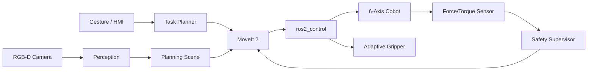

# MATE: ROS 2 Collaborative Robot

> **사람의 의도를 이해하고, 같은 공간에서 안전하게 협업하는 지능형 로봇 동료**

[](https://docs.ros.org/en/humble/)
[](https://ubuntu.com/)
[](https://moveit.picknik.ai/)
[](https://gazebosim.org/)


MATE는 제조 및 물류 현장에서 작업자와 협업하는 **ROS 2 기반 6축 협동로봇 플랫폼**을 목표로 하는 프로젝트입니다. 비전 인식, 충돌 회피, 힘 제어, 작업 계획을 하나의 시스템으로 통합하여 부품 전달부터 정밀 조립까지 자연스럽고 안전한 Human-Robot Collaboration을 구현합니다.

> [!NOTE]
> 이 저장소는 협동로봇 프로젝트를 가정해 구성한 초기 콘셉트입니다. 아래 기능, 패키지, 실행 명령은 향후 구현 목표를 포함합니다.

## Project Vision

```text
             Perception                    Intelligence
        RGB-D / Pose / Gesture        Task Planner / Digital Twin
                    \                    /
                     \                  /
                      +---- MATE ----+
                     /                \
                    /                  \
          MoveIt 2 / Servo       Force / Safety Control
              Manipulation              Interaction
```

MATE가 지향하는 핵심 원칙은 세 가지입니다.

- **Safe by Design**: 사람 감지, 속도 및 거리 모니터링, 비상 정지를 제어 전 주기에 반영합니다.
- **Natural Collaboration**: 제스처와 작업 상태를 인식해 별도의 복잡한 조작 없이 사람과 협업합니다.
- **Simulation First**: Gazebo와 RViz에서 검증한 동일한 ROS 2 인터페이스를 실제 로봇에도 적용합니다.

## Key Features

| 영역 | 주요 기능 |
| --- | --- |
| Motion Planning | MoveIt 2 기반 경로 계획, 실시간 장애물 회피, Cartesian 제어 |
| Robot Vision | RGB-D 객체 검출, 6D Pose 추정, Hand-Eye Calibration |
| Collaboration | 작업자 접근 감지, 제스처 기반 명령, 부품 인계 시나리오 |
| Safety | Safety Zone, 속도 제한, 충돌 및 접촉 감지, E-Stop 연동 |
| Manipulation | Adaptive Gripper, 힘/토크 기반 삽입 및 조립, ROS 2 Control |
| Digital Twin | Gazebo 시뮬레이션, RViz 시각화, rosbag 기반 재현 및 분석 |

## Demo Scenario

대표 데모는 작업자와 로봇이 함께 수행하는 **스마트 조립 셀**입니다.

1. RGB-D 카메라가 작업대의 부품 종류와 위치를 인식합니다.
2. 작업자의 손짓 또는 작업 지시를 받아 필요한 부품을 선택합니다.
3. MoveIt 2가 작업자와 장애물을 고려한 안전 경로를 생성합니다.
4. 로봇이 부품을 집어 작업자에게 전달하거나 조립 위치에 삽입합니다.
5. 힘/토크 센서로 체결 상태를 확인하고 작업 결과를 기록합니다.

## System Architecture



### Planned Packages

```text
mate_ws/src/
├── mate_bringup/          # 전체 시스템 실행 및 파라미터
├── mate_description/      # URDF/Xacro, meshes, SRDF
├── mate_gazebo/           # 디지털 트윈 및 테스트 월드
├── mate_moveit_config/    # MoveIt 2 설정과 motion pipeline
├── mate_perception/       # 객체/작업자 인식과 pose estimation
├── mate_manipulation/     # Pick, handover, assembly skill
├── mate_safety/           # Safety zone과 supervisor
└── mate_interfaces/       # Custom message, service, action
```

## Tech Stack

- **Middleware**: ROS 2 Humble, DDS
- **Motion**: MoveIt 2, MoveIt Servo, OMPL
- **Control**: ros2_control, joint trajectory controller
- **Simulation**: Gazebo, RViz 2
- **Perception**: OpenCV, PCL, optional YOLO/ONNX Runtime
- **Language**: C++17, Python 3
- **Platform**: Ubuntu 22.04

## Getting Started

### Requirements

- Ubuntu 22.04
- ROS 2 Humble
- MoveIt 2
- Gazebo 및 `colcon`, `rosdep`

### Build

아래 명령은 패키지 구현 이후 사용할 예정인 워크스페이스 구성 예시입니다.

```bash
mkdir -p ~/mate_ws/src
cd ~/mate_ws/src
git clone https://github.com/<your-org>/mate.git
cd ~/mate_ws
rosdep install --from-paths src --ignore-src -r -y
colcon build --symlink-install
source install/setup.bash
```

### Run Simulation

```bash
ros2 launch mate_bringup simulation.launch.py
```

### Run Collaborative Assembly Demo

```bash
ros2 launch mate_bringup assembly_demo.launch.py use_sim:=true
```

시뮬레이션 실행 후 RViz의 Planning Scene에서 작업자 안전 영역과 로봇 경로를 확인할 수 있습니다.

## Safety Concept

MATE의 안전 계층은 로봇 동작 명령보다 항상 높은 우선순위를 갖도록 설계합니다.

| 상태 | 조건 | 동작 |
| --- | --- | --- |
| `NORMAL` | 작업자와 충분한 거리 유지 | 계획 속도로 작업 수행 |
| `CAUTION` | 작업자가 감속 영역 진입 | TCP 속도 및 가속도 제한 |
| `STOP` | 보호 영역 침범 또는 충돌 감지 | 즉시 정지 후 재계획 대기 |
| `E-STOP` | 하드웨어 비상 정지 입력 | 구동 전원 차단 및 수동 복구 |

> [!WARNING]
> 본 프로젝트의 소프트웨어 안전 기능만으로 산업 현장의 안전을 보장할 수 없습니다. 실제 장비 적용 시 ISO 10218, ISO/TS 15066 및 현지 안전 규정을 기준으로 별도의 위험성 평가와 인증된 안전 장치를 사용해야 합니다.

## Roadmap

- [ ] Phase 1: 로봇 모델, Gazebo 월드, ros2_control 통합
- [ ] Phase 2: MoveIt 2 기반 Pick & Place와 충돌 회피
- [ ] Phase 3: RGB-D 객체 인식 및 6D Pose 추정
- [ ] Phase 4: 작업자 추적, Safety Zone, 감속/정지 정책
- [ ] Phase 5: 힘 제어 기반 부품 인계 및 정밀 조립
- [ ] Phase 6: 실제 협동로봇 연동과 통합 데모

## Contributing

Issue와 Pull Request를 환영합니다. 새로운 기능은 시뮬레이션 테스트와 안전 영향 분석을 함께 제출해 주세요.

1. 저장소를 Fork하고 기능 브랜치를 생성합니다.
2. 변경 사항과 테스트를 작성합니다.
3. `colcon test`로 전체 테스트를 확인합니다.
4. 변경 목적과 검증 결과를 포함해 Pull Request를 생성합니다.

## License

라이선스는 실제 배포 정책과 사용 장비의 SDK 조건을 검토한 뒤 확정할 예정입니다.

---

<p align="center">
  <strong>MATE</strong> · Move together. Assemble smarter. Team up safely.
</p>
